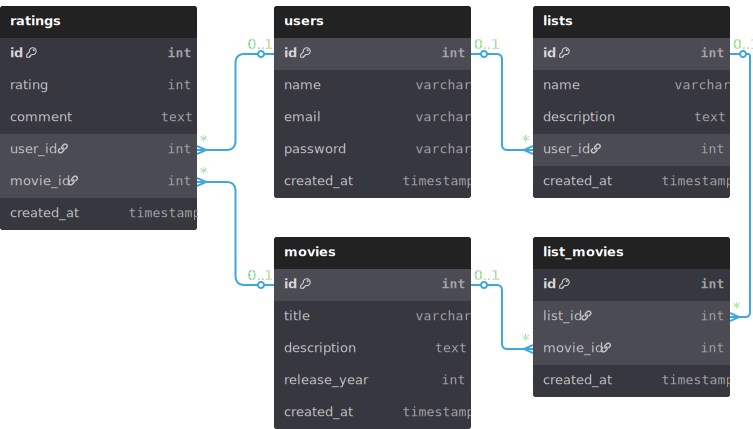

# 🎬 Projeto: Plataforma de Catálogo e Recomendação de Filmes

## 📌 Visão Geral
Desenvolver uma aplicação web que funcione como um banco de filmes, permitindo que usuários cadastrem contas, consultem informações detalhadas sobre filmes, criem listas personalizadas e recebam recomendações baseadas em seus gostos e histórico de avaliações.

---

## 🛠 Tecnologias
- **Backend:** FastAPI (Python)
- **Frontend:** Vue.js
- **Estilização:** Chakra UI ou Bootstrap (a definir)
- **Banco de Dados:** PostgreSQL
- **Integração de Dados de Filmes:** API do TMDb (The Movie Database)
- **Controle de Versão:** Git + GitHub
- **Deploy (futuro):** Docker + hospedagem em nuvem (AWS, Azure ou similar)

---

## 🎯 Funcionalidades Principais (MVP)

### 1. **Autenticação e Usuários**
- Cadastro de conta (nome, e-mail, senha, avatar opcional).
- Login/Logout.
- Edição de perfil.
- Questionário inicial de preferências de gêneros para novas contas.

### 2. **Banco de Dados de Filmes**
- Sincronização com API externa (TMDb) para obter:
  - Nome do filme
  - Ano de lançamento
  - Sinopse
  - Nota da crítica (IMDb/TMDb)
  - Elenco
  - Diretor
  - Pôster
  - Gêneros
- Armazenar filmes consultados no banco local para agilizar buscas futuras.

### 3. **Busca de Filmes**
- Campo de pesquisa por nome do filme.
- Resultados paginados.
- Exibição com pôster, nome e ano.
- Filtro por gênero e ano (futuro).

### 4. **Listas Personalizadas**
- Criar listas customizadas (nome e descrição).
- Adicionar/remover filmes da lista.
- Opção de listas privadas ou públicas (futuro).

### 5. **Avaliações de Usuário**
- Avaliar filmes com nota de **0 a 10**.
- Editar ou remover avaliação.
- Visualizar média de notas dadas pelo usuário.

### 6. **Sistema de Recomendação**
- **Etapa inicial:** Recomendações baseadas em gêneros preferidos + filmes bem avaliados no IMDb/TMDb.
- **Etapa posterior:** Filtro colaborativo com base em avaliações e histórico de filmes assistidos.
- Atualização periódica das recomendações.

---

## 📅 Roadmap Inicial

### **1ª Etapa (5-6 dias)**
- Configuração do ambiente (FastAPI, Vue.js, PostgreSQL).
- Estrutura inicial do banco de dados.
- Implementação de autenticação (JWT).
- Integração com API do TMDb (consulta e armazenamento básico).
- Tela inicial + tela de login/cadastro no frontend.

### **2ª Etapa (5 - 6 dias)**
- Implementar busca de filmes no frontend.
- Criar sistema de listas personalizadas.
- Implementar avaliações (0 a 10).
- Página de detalhes do filme com informações completas.

### **3ª Etapa**
- Implementar recomendação inicial baseada em gêneros e avaliações externas.
- Implementar quiz inicial para novas contas.
- Melhorias de UI/UX com Chakra UI ou Bootstrap.
- Preparar ambiente para deploy (Docker + banco remoto).

---

## 🗂 Estrutura do Projeto

**Backend (FastAPI)**
- `/app/main.py` – ponto de entrada da API
- `/app/models/` – modelos ORM (SQLAlchemy)
- `/app/schemas/` – schemas Pydantic
- `/app/routes/` – rotas da API
- `/app/services/` – lógica de integração com API externa e recomendações
- `/app/auth/` – autenticação e autorização

**Frontend (Vue.js)**
- `/src/views/` – páginas principais
- `/src/components/` – componentes reutilizáveis
- `/src/store/` – estado global (Pinia ou Vuex)
- `/src/services/` – comunicação com API

## Modelo Banco

  

## 📌 Próximas Ideias (pós-MVP)
- Listas públicas e compartilháveis.
- Seguidores e sistema social.
- Recomendação híbrida (conteúdo + colaborativo).
- Modo “Assistir depois”.
- Notificações para novos lançamentos no gênero preferido.
